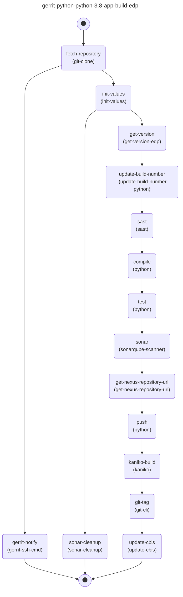

[](https://github.com/sergk/tkn-graph/releases/latest)
[](https://sonarcloud.io/summary/new_code?id=sergk_tkn-graph)
[](https://goreportcard.com/report/github.com/sergk/tkn-graph)

<!-- TOC -->

- [Tekton Graph](#tekton-graph)
  - [Prerequisites](#prerequisites)
  - [Installation](#installation)
  - [Usage](#usage)
    - [Run the Command](#run-the-command)
    - [Examples](#examples)
    - [Output](#output)
  - [Contributing](#contributing)
  - [License](#license)

<!-- /TOC -->

# Tekton Graph

The provided Go program is a command-line tool named `tkn-graph` for generating graphs from Tekton Customer Resources: `Pipeline` and `PipelineRun`. This tool is used to visualize the structure and relationships between tasks of Tekton `Pipelines` and `PipelineRuns` by creating output in [PlantUML](https://plantuml.com/), [Mermaid](https://mermaid.js.org/) and [Dot (GraphViz)](https://graphviz.org/doc/info/lang.html).

## Prerequisites

Before using the `tkn-graph` tool, you should ensure you have the following prerequisites:

1. **Kubernetes Cluster**: You need access to a running Kubernetes cluster.

2. **Tekton Client**: The tool uses the Tekton client to interact with Tekton resources, so you must have Tekton installed on your cluster.

3. **Kubeconfig**: You should have a valid kubeconfig file configured for the cluster you want to target.

## Installation

Download the latest binary from the [releases page](https://github.com/sergk/tkn-graph/releases/latest)

or building locally:

You need to have Go installed on your system. Once you have Go installed, you can build the project using the following command:

```bash
make build
```

## Usage

The `tkn-graph` tool has several command-line options and can generate different types of output graphs, such as `DOT`, `PlantUML`, or `Mermaid`. Below are the detailed steps for using the tool:

### Run the Command

Execute the `tkn-graph` tool from the command line with the following syntax:

```bash
tkn-graph is a command-line tool for generating graphs from Tekton Pipelines and PipelineRuns.

Usage:
  tkn-graph [command]

Available Commands:
  completion  Generate the autocompletion script for the specified shell
  help        Help about any command
  pipeline    Graph pipelines
  pipelinerun Graph PipelineRuns

Flags:
  -h, --help   help for tkn-graph

Use "tkn-graph [command] --help" for more information about a command.
```

The `[flags]` correspond to various options and arguments that you can provide to customize the tool's behavior. Here are the available flags:

- `--output-format` (string, optional): Choose the output format for the graph. You can use "dot" for DOT, "puml" for PlantUML, or "mmd" for Mermaid. The default format is "dot"

- `--output-dir` (string, optional): Specify the directory where the output files will be saved. If not provided, the output will be printed to the console.

- `--with-task-ref` (boolean, optional): Include TaskRefName information in the output. This flag is useful for getting taskRef which points to original `Task`.

### Examples

The `tkn-graph` tool is flexible and can be customized to meet your specific needs. Here are some example commands:

- Generate a DOT format graph for Pipelines in the "my-namespace" namespace and print it to the screen:

  ```bash
  $ tkn-graph pipelinerun graph --namespace my-namespace --output-format dot

  digraph {
    labelloc="t"
    label="python-3-8-release-create-build-release-1.2-review-srrcc"
    end [shape="point" width=0.2]
    start [shape="point" width=0.2]
    "compile" -> "test"
    "test" -> "fetch-target-branch"
    "dockerfile-lint" -> "dockerbuild-verify"
    "helm-lint" -> "end"
    "init-values" -> "compile"
    "start" -> "gerrit-notify"
    "gerrit-notify" -> "end"
    "helm-docs" -> "end"
    "fetch-target-branch" -> "sonar-prepare-files"
    "sonar-prepare-files" -> "sonar"
    "sonar" -> "dockerbuild-verify"
    "dockerbuild-verify" -> "end"
    "start" -> "fetch-repository"
    "fetch-repository" -> "init-values"
    "fetch-repository" -> "helm-docs"
    "fetch-repository" -> "dockerfile-lint"
    "fetch-repository" -> "helm-lint"
  }
  ```

- Generate a PlantUML format graph for PipelineRuns in the "my-namespace" namespace and save it to a file:

  ```bash
  $ tkn-graph pipelinerun graph --namespace my-namespace --output-format puml --output-dir output

  $ ls -1 output

  dotnet-6-0-lib-release-create-build-release-1.2-build-fhm9j.puml
  dotnet-6-0-lib-release-create-build-release-1.2-review-ld6d8.puml
  java11-mvn-create-def-build-master-build-jckk4.puml
  java11-mvn-create-def-build-master-review-rs7s5.puml
  java17-grd-crt-edp-dep-release-1.2-build-5z5s2.puml
  java17-grd-crt-edp-dep-release-1.2-review-qnws2.puml
  js-create-br-edp-build-new-build-dhjg5.puml
  js-create-br-edp-build-new-review-28rmr.puml
  python-3-8-release-create-build-release-1.2-build-fmt6f.puml
  python-3-8-release-create-build-release-1.2-review-rnwpq.puml

  $ cat output/python-3-8-release-create-build-release-1.2-review-rnwpq.puml

  @startuml
  hide empty description
  title python-3-8-release-create-build-release-1.2-review-rnwpq

  [*] --> gerrit_notify
  init_values <-down- fetch_repository
  helm_docs <-down- fetch_repository
  [*] --> fetch_repository
  test <-down- compile
  fetch_target_branch <-down- test
  sonar_prepare_files <-down- fetch_target_branch
  sonar <-down- sonar_prepare_files
  dockerfile_lint <-down- fetch_repository
  dockerbuild_verify <-down- sonar
  dockerbuild_verify <-down- dockerfile_lint
  helm_lint <-down- fetch_repository
  compile <-down- init_values

  @enduml
  ```

- Generate a Mermaid format graph with TaskRef for Pipelines in the "my-namespace" namespace and save it to a file:

  ```bash
  $ tkn-graph pipeline graph --namespace edp-delivery-tekton-dev --output-format mmd --with-task-ref

  ---
  title: gerrit-python-python-3.8-app-build-edp
  ---
  flowchart TD
    get-nexus-repository-url("get-nexus-repository-url
    (get-nexus-repository-url)") --> push("push
    (python)")
    git-tag("git-tag
    (git-cli)") --> update-cbis("update-cbis
    (update-cbis)")
    start([fa:fa-circle]) --> fetch-repository("fetch-repository
    (git-clone)")
    fetch-repository("fetch-repository
    (git-clone)") --> gerrit-notify("gerrit-notify
    (gerrit-ssh-cmd)")
    fetch-repository("fetch-repository
    (git-clone)") --> init-values("init-values
    (init-values)")
    gerrit-notify("gerrit-notify
    (gerrit-ssh-cmd)") --> stop([fa:fa-circle])
    compile("compile
    (python)") --> test("test
    (python)")
    test("test
    (python)") --> sonar("sonar
    (sonarqube-scanner)")
    get-version("get-version
    (get-version-edp)") --> update-build-number("update-build-number
    (update-build-number-python)")
    sonar-cleanup("sonar-cleanup
    (sonar-cleanup)") --> stop([fa:fa-circle])
    push("push
    (python)") --> kaniko-build("kaniko-build
    (kaniko)")
    kaniko-build("kaniko-build
    (kaniko)") --> git-tag("git-tag
    (git-cli)")
    update-cbis("update-cbis
    (update-cbis)") --> stop([fa:fa-circle])
    init-values("init-values
    (init-values)") --> get-version("get-version
    (get-version-edp)")
    init-values("init-values
    (init-values)") --> sonar-cleanup("sonar-cleanup
    (sonar-cleanup)")
    update-build-number("update-build-number
    (update-build-number-python)") --> sast("sast
    (sast)")
    sast("sast
    (sast)") --> compile("compile
    (python)")
    sonar("sonar
    (sonarqube-scanner)") --> get-nexus-repository-url("get-nexus-repository-url
    (get-nexus-repository-url)")
  ```

### Output

Depending on the options you provided, the tool will generate the specified graph(s) and either print them to the console or save them in the specified directory.

- If you chose to print the graph, it will be displayed on the screen.
- If you specified an output directory, the tool will save the graph(s) in that directory with filenames based on the Tekton object's name and the chosen output format.

By following these steps and customizing the flags, you can use the `tkn-graph` tool to generate representations of Tekton Pipelines and PipelineRuns within your Kubernetes cluster. The next step you can use mermaid, plantuml or dot to generate a graph.



## Contributing

If you want to contribute to the project, you can fork the repository and create a pull request with your changes. Make sure to follow the coding style and conventions used in the project.

## License

The project is licensed under the APACHE License. See the [LICENSE](./LICENSE) file for more information.
