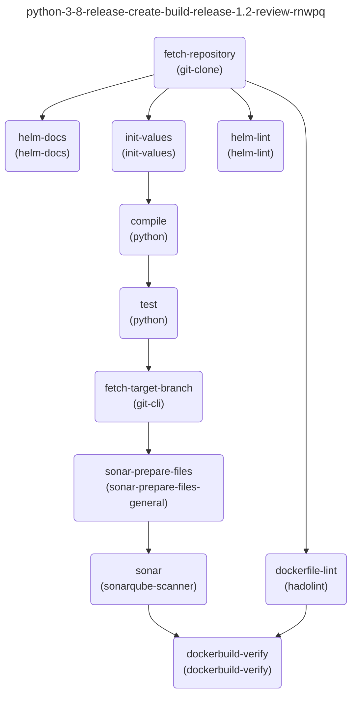

# Tekton Graph

<!-- TOC -->

- [Tekton Graph](#tekton-graph)
  - [Prerequisites](#prerequisites)
  - [Installation](#installation)
  - [Usage](#usage)
    - [Run the Command](#run-the-command)
    - [Examples](#examples)
    - [Output](#output)
  - [Contributing](#contributing)
  - [License](#license)

<!-- /TOC -->

The provided Go program is a command-line tool named `tkn-graph` for generating graphs from Tekton objects. This tool is used to visualize the structure and relationships of Tekton `Pipelines` and `PipelineRuns` by creating graphical representations of their tasks.

## Prerequisites

Before using the `tkn-graph` tool, you should ensure you have the following prerequisites:

1. **Kubernetes Cluster**: You need access to a running Kubernetes cluster.

2. **Tekton Client**: The tool uses the Tekton client to interact with Tekton resources, so you must have Tekton installed on your cluster.

3. **Kubeconfig**: You should have a valid kubeconfig file configured for the cluster you want to target.

## Installation

To install the project, you need to have Go installed on your system. You can download and install Go from the official [website](https://golang.org/dl/).

Once you have Go installed, you can build the project using the following command:

```bash
make build
```

## Usage

The `tkn-graph` tool has several command-line options and can generate different types of output graphs, such as `DOT`, `PlantUML`, or `Mermaid`. Below are the detailed steps for using the tool:

### Run the Command

Execute the `tkn-graph` tool from the command line with the following syntax:

```bash
  tkn-graph --help
  graph is a command-line tool for generating graphs from Tekton kind: Pipelines and kind: PipelineRuns.

  Usage:
    graph [flags]

  Examples:
    graph --namespace my-namespace --kind Pipeline --output-format dot
    graph --namespace my-namespace --kind PipelineRun --output-format puml
    graph --namespace my-namespace --kind Pipeline --output-format mmd --output-dir /tmp/output

  Flags:
    -h, --help                   help for graph
        --kind string            the kind of the Tekton object to parse (Pipeline or PipelineRun) (default "Pipeline")
        --namespace string       the Kubernetes namespace to use. Will try to get namespace from KUBECONFIG if not specified then fallback to 'default'
        --output-dir string      the directory to save the output files. Otherwise, the output is printed to the screen
        --output-format string   the output format (dot - DOT, puml - PlantUML or mmd - Mermaid) (default "dot")
        --with-task-ref          Include TaskRefName information in the output
```

The `[flags]` correspond to various options and arguments that you can provide to customize the tool's behavior. Here are the available flags:

- `--namespace` (string, optional): Specify the Kubernetes namespace you want to work in. If not provided, the tool will try to get the namespace from your kubeconfig. If it can't determine the namespace from there, it will default to "default"

- `--kind` (string, optional): Specify the kind of Tekton object you want to visualize. It can be "Pipeline" or "PipelineRun." The default value is "Pipeline"

- `--output-format` (string, optional): Choose the output format for the graph. You can use "dot" for DOT, "puml" for PlantUML, or "mmd" for Mermaid. The default format is "dot"

- `--output-dir` (string, optional): Specify the directory where the output files will be saved. If not provided, the output will be printed to the console.

- `--with-task-ref` (boolean, optional): Include TaskRefName information in the output. This flag is useful for getting taskRef which points to original `Task`.

### Examples

The `tkn-graph` tool is flexible and can be customized to meet your specific needs. Here are some example commands:

- Generate a DOT format graph for Pipelines in the "my-namespace" namespace and print it to the screen:

  ```bash
  tkn-graph --namespace my-namespace --kind Pipeline --output-format dot

  digraph {
    labelloc="t"
    label="python-3-8-release-create-build-release-1.2-review-rnwpq"
    "fetch-repository" -> "helm-lint"
    "init-values" -> "compile"
    "test" -> "fetch-target-branch"
    "sonar-prepare-files" -> "sonar"
    "fetch-repository" -> "dockerfile-lint"
    "sonar" -> "dockerbuild-verify"
    "dockerfile-lint" -> "dockerbuild-verify"
    "fetch-repository" -> "init-values"
    "fetch-repository" -> "helm-docs"
    "compile" -> "test"
    "fetch-target-branch" -> "sonar-prepare-files"
  }
  ```

- Generate a PlantUML format graph for PipelineRuns in the "my-namespace" namespace and save it to a file:

  ```bash
  $ tkn-graph --namespace my-namespace --kind PipelineRun --output-format puml --output-dir output

  $ ls -1 output

  dotnet-6-0-lib-release-create-build-release-1.2-build-fhm9j.puml
  dotnet-6-0-lib-release-create-build-release-1.2-review-ld6d8.puml
  java11-mvn-create-def-build-master-build-jckk4.puml
  java11-mvn-create-def-build-master-review-rs7s5.puml
  java17-grd-crt-edp-dep-release-1.2-build-5z5s2.puml
  java17-grd-crt-edp-dep-release-1.2-review-qnws2.puml
  js-create-br-edp-build-new-build-dhjg5.puml
  js-create-br-edp-build-new-review-28rmr.puml
  python-3-8-release-create-build-release-1.2-build-fmt6f.puml
  python-3-8-release-create-build-release-1.2-review-rnwpq.puml

  $ cat output/python-3-8-release-create-build-release-1.2-review-rnwpq.puml

  @startuml
  hide empty description
  title python-3-8-release-create-build-release-1.2-review-rnwpq

  [*] --> gerrit_notify
  init_values <-down- fetch_repository
  helm_docs <-down- fetch_repository
  [*] --> fetch_repository
  test <-down- compile
  fetch_target_branch <-down- test
  sonar_prepare_files <-down- fetch_target_branch
  sonar <-down- sonar_prepare_files
  dockerfile_lint <-down- fetch_repository
  dockerbuild_verify <-down- sonar
  dockerbuild_verify <-down- dockerfile_lint
  helm_lint <-down- fetch_repository
  compile <-down- init_values

  @enduml
  ```

- Generate a Mermaid format graph with TaskRef for Pipelines in the "my-namespace" namespace and save it to a file:

  ```bash
  tkn-graph --namespace my-namespace --kind Pipeline --output-format mmd --with-task-ref

  ---
  title: python-3-8-release-create-build-release-1.2-review-rnwpq
  ---
  flowchart TD
    test("test
    (python)") --> fetch-target-branch("fetch-target-branch
    (git-cli)")
    fetch-repository("fetch-repository
    (git-clone)") --> helm-docs("helm-docs
    (helm-docs)")
    compile("compile
    (python)") --> test("test
    (python)")
    fetch-repository("fetch-repository
    (git-clone)") --> init-values("init-values
    (init-values)")
    init-values("init-values
    (init-values)") --> compile("compile
    (python)")
    fetch-target-branch("fetch-target-branch
    (git-cli)") --> sonar-prepare-files("sonar-prepare-files
    (sonar-prepare-files-general)")
    sonar-prepare-files("sonar-prepare-files
    (sonar-prepare-files-general)") --> sonar("sonar
    (sonarqube-scanner)")
    fetch-repository("fetch-repository
    (git-clone)") --> dockerfile-lint("dockerfile-lint
    (hadolint)")
    sonar("sonar
    (sonarqube-scanner)") --> dockerbuild-verify("dockerbuild-verify
    (dockerbuild-verify)")
    dockerfile-lint("dockerfile-lint
    (hadolint)") --> dockerbuild-verify("dockerbuild-verify
    (dockerbuild-verify)")
    fetch-repository("fetch-repository
    (git-clone)") --> helm-lint("helm-lint
    (helm-lint)")
  ```

### Output

Depending on the options you provided, the tool will generate the specified graph(s) and either print them to the console or save them in the specified directory.

- If you chose to print the graph, it will be displayed on the screen.
- If you specified an output directory, the tool will save the graph(s) in that directory with filenames based on the Tekton object's name and the chosen output format.

By following these steps and customizing the flags, you can use the `tkn-graph` tool to generate representations of Tekton Pipelines and PipelineRuns within your Kubernetes cluster. The next step you can use mermaid, plantuml or dot to generate a graph.



## Contributing

If you want to contribute to the project, you can fork the repository and create a pull request with your changes. Make sure to follow the coding style and conventions used in the project.

## License

The project is licensed under the APACHE License. See the [LICENSE](./LICENSE) file for more information.
